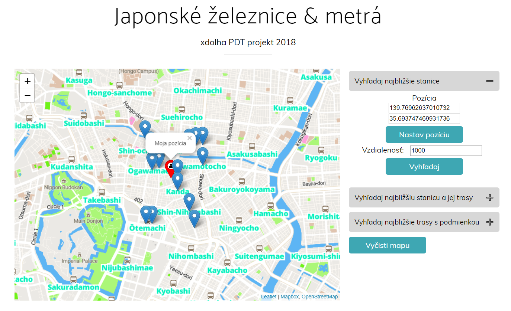

# Overview

Aplikácia je zameraná na železnice a metrá v Japonskom regióne Kanto. Poskytuje 3 scenáre:
1. Možnosť vyhľadať stanice v okolí s určeným polomerom od zadanej pozície.
2. Možnosť vyhľadať najbližšiu stanicu od zadanej pozície a ňou prechádzajúce metrové a železničné trate.
3. Možnosť vyhľadať železničné a metrové trate v okolí s určeným polomerom od zadanej pozície s podmienkami. Dostupné podmienky pre trate sú: prechod cez most, prechod tunelom, prechod vodnou plochou. Je možné lubovoľne nakombinovať dané podmienky.

Aplikácia samozrejme ponúka možnosť premazania mapy. Zadávana pozícia používateľom má vlastnú značku.

Ukážková snímka z aplikácie:



Klient je [webová aplikácia](#frontend), ktorá používa [leaflet.js](http://leafletjs.com/). [Server](#backend) je písaný v [Pythone](https://www.python.org/) a [Djangu](https://www.djangoproject.com/), s PostGIS databázou. Klient posiela požiadavky na server cez [REST API](#api).

# Frontend

Frontend tvorí statická HTML stránka (`index.html`), na ktorej je zobrazená mapa cez [leaflet.js](http://leafletjs.com/) widget spolu z možnosťami použitia. Vzhľad mapy je upravený pomocou [mapbox](http://mapbox.com). Úpravy mapy boli nasledovné:
1. Pridanie vrstvy s názvami železničných staníc, ich zmena farby na tyrkysovú spolu s bielym lemom a pridanie ikonky.
2. Zmena farby vrstiev Water a Waterway (vodných plôch) na bledšie modrú.
3. Zmena farby vrstiev Landuse a National park na iný odtieň zelenej.
4. Zmena farby vrstvy Background (pozadia mapy) na bledú šedo-béžovú.
Vzhľad aplikácie je pomocou css, pre ktorý ako podklad slúžila bootstrap téma [new-age](https://startbootstrap.com/template-overviews/new-age/). Css bolo zbavené nepoužívaných štýlov a bolo upravené a doplnené o nové štýly. Aplikácia je responzívna, a teda mení svoje rozmery a usporiadanie podľa rozmerov prehliadača.

Všetken kód pre frontend sa nachádza v `script.js`, ktorý je referencovaný z `index.html`. Má za úlohu iba:
- inštancovať a nastaviť mapu
- odosielanie a spracovanie REST požiadaviek na server
- zobrazovanie výsledkov volaní z geojsonu na mape
- premazanie údajov na mape
- zaznamenanie pozície na základe kliknutia na mape pri jej zadávaní

# Backend

Backend je napísaný v Pythone a Djangu. Komunikuje a dopytuje geo dáta z databázy, spracuje a upravuje geojsony pre frontend (úprava formátu a pridáva popup popisky pri niektorých scenároch).

## Data

Dáta sú z Open Street Maps. Kanto región má 212MB a bol importovaný do databázy za pomoci `osm2pgsql`. Indexy boli vytvorené nad stĺpcom railway a way (geo index) pre každú tabuľku, pri polygónoch bol vytvorený ešte index nad stĺpcami water a waterway a pri líniach nad stĺpcami bridge a tunnel. GeoJSONy sú generované v dopytoch pomocou štandartne dostupných funkcií, avšak na strane servera je nutné ešte ich spracovanie na úpravu formátu a pre zjednotenie v prípade viacerých dopytov.

Query pre 1. scenár:
```sql
WITH my_res AS (SELECT osm_id, name, ST_AsGeoJSON(ST_Transform(way,4326)) AS geometry 
                FROM planet_osm_point 
		WHERE railway LIKE 'station' 
		AND ST_DWithin(ST_Transform(way,4326), 
				T_SetSRID(ST_Point(%s, %s),4326), 
				56::float*%s::float/6371000::float) 
		UNION SELECT osm_id, name, ST_AsGeoJSON(ST_Transform(way,4326)) AS geometry 
                FROM planet_osm_polygon 
		WHERE railway LIKE 'station' 
		AND ST_DWithin(ST_Transform(way,4326), 
			       ST_SetSRID(ST_Point(%s, %s),4326), 
			       56::float*%s::float/6371000::float)) 
SELECT json_build_object( 
    'type',       'Feature', 
    'geometry',   geometry::json, 
    'properties', json_build_object( 
        'name', name 
     ) 
) 
FROM my_res
```

Query pre 2. scenár:
```sql
WITH my_res AS (SELECT osm_id, name, ST_AsGeoJSON(ST_Transform(way,4326)) AS geometry 
                FROM planet_osm_point 
		WHERE railway LIKE 'station' 
		AND ST_DISTANCE(ST_Transform(way,4326), 
				ST_SetSRID(ST_Point(%s, %s),4326)) 
		= (SELECT min(ST_DISTANCE(ST_Transform(way,4326), 
					  ST_SetSRID(ST_Point(%s, %s),4326))) 
		   FROM planet_osm_point WHERE railway LIKE 'station')) 
SELECT json_build_object( 
    'type',       'Feature', 
    'geometry',   geometry::json, 
    'properties', json_build_object( 
        'name', name 
     ) '
) 
FROM my_res
```
```sql
WITH my_station AS (SELECT ST_Transform(way,4326) as geometry 
		    FROM planet_osm_point WHERE railway LIKE 'station' 
		    AND ST_DISTANCE(ST_Transform(way,4326), 
				    ST_SetSRID(ST_Point(%s, %s),4326)) 
			= (SELECT min(ST_DISTANCE(ST_Transform(way,4326), 
						  ST_SetSRID(ST_Point(%s, %s),4326))) 
			   FROM planet_osm_point 
			   WHERE railway LIKE 'station')), 
my_dist AS (SELECT min(ST_DISTANCE(ST_ClosestPoint(ST_Transform(way,4326),(SELECT geometry FROM my_station)), 
				   (SELECT geometry FROM my_station))) as min_dist 
            FROM planet_osm_line 
	    WHERE (railway LIKE 'rail' OR railway LIKE 'subway')), 
my_res AS (SELECT osm_id, name, operator, railway, ST_AsGeoJSON(ST_Transform(way,4326)) AS geometry 
	   FROM planet_osm_line 
	   WHERE (railway LIKE 'rail' OR railway LIKE 'subway') 
	   AND ST_DISTANCE(ST_ClosestPoint(ST_Transform(way,4326), (SELECT geometry FROM my_station)), 
					   (SELECT geometry FROM my_station))::numeric 
	       < 0.0001::numeric) 
SELECT json_build_object( 
    'type',       'Feature', 
    'geometry',   geometry::json, 
    'properties', json_build_object( 
         'name', name, 
		 'operator', operator, 
		 'railway', railway 
     ) 
) 
FROM my_res
```

Query pre 3. scenár:
```sql
WITH waters AS (SELECT way 
		FROM planet_osm_polygon 
		WHERE ST_DWithin(ST_SetSRID(ST_Point(%s, %s),4326), 
				 ST_Transform(way,4326), 
				 56::float*%s::float/6371000::float) 
		AND (water IS NOT NULL OR waterway IS NOT NULL)), 
my_res AS (SELECT l.osm_id, l.name, l.operator, l.railway, 
	   ST_AsGeoJSON(ST_Transform(l.way,4326)) AS geometry, 
	   ST_Length(ST_Transform(l.way,4326)::geography) AS my_length 
	   FROM planet_osm_line AS l 
	   CROSS JOIN waters AS w 
           WHERE (l.railway LIKE 'rail' OR l.railway LIKE 'subway') 
	   AND ST_DWithin(ST_SetSRID(ST_Point(%s, %s),4326), 
			  ST_Transform(l.way,4326), 
			  56::float*%s::float/6371000::float) 
	   AND l.bridge IS NOT DISTINCT FROM %s 
	   AND l.tunnel IS NOT DISTINCT FROM %s 
	   AND (ST_Intersects(ST_Transform(l.way,4326), 
			      ST_Transform(w.way,4326)) = 't' 
		OR ST_Touches(ST_Transform(l.way,4326), '
			      ST_Transform(w.way,4326)) = 't')) 
SELECT json_build_object( 
    'type',       'Feature', 
    'geometry',   geometry::json, 
    'properties', json_build_object( 
        'name', name, 
        'operator', operator, 
		'railway', railway, 
		'my_length', my_length 
     )
) 
FROM my_res
```

## Api

Príklady volaní:

**Prvý scenár**

`GET /nearestStations/?lon=139.73560310143515&lat=35.68262143826268&dist=1000`

**Druhý scenár**

`GET /station&routes/?startLon=139.7617299546255&startLat=35.69519736894893`

**Tretí scenár**

`GET /routes-w-cond/?lon=139.78334000450562&lat=35.68674859912015&dist=1000&bridge=false&tunnel=true&water=true`

### Response

API volania vracajú geojson objekty. Pole `features` obsahuje všetky nájdené objekty z dopytu. Každý riadok vo features predstavuje jeden objekt, ktorý obsahuje `geometry` s geografickými údajmi a `properties` s nasledovnou štruktúrou:
```
{
  "name": "都営地下鉄浅草線",
  "operator": "東京都交通局", 
  "railway": "subway",
  "popupContent": "<p>Meno: 都営地下鉄浅草線<br>Operátor: 東京都交通局<br>Typ: metro<br>Dĺžka: 11074.95 m</p>"
  "my_length": 11074.9535536922
}
```
Táto štruktúra platí pre 3. scenár. V 2. scenári chýba pole `my_length` aj jeho výskyt v `popupContent`. V 1. scenári sa v tejto štruktúre nachádza iba pole `name`.
